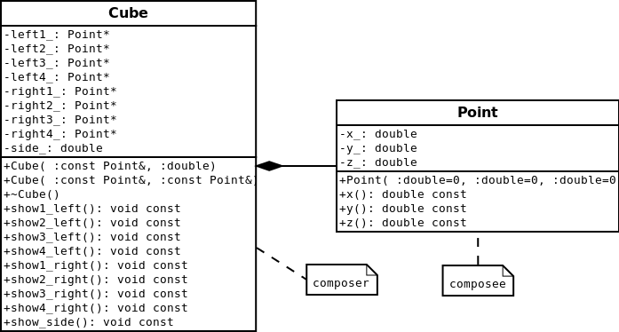
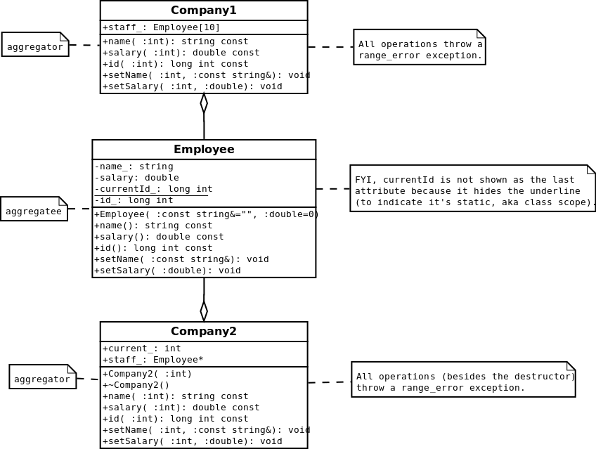

Assignment 2
------------

Based on the book *C++ Programming with Design Patterns Revealed*

Diagrams made with Dia 0.97.2.

Code tested with clang++ version 3.2.
g++ (minimum GCC 4.5) should also work.  
Run `make` to build the executables.

---

#### UML class diagram for exercise 3.7
> Repeat exercise 3.6, but this time use pointers to `Point`s rather than nested
> objects in the class `Cube`.

I used a composition link between the classes because there is a "owns a"
relationship. The `Cube` class is the exclusive container of the `Point` class.

Note that the code for exercise 3.7 was provided to me.
Also note that my class diagrams look slightly different than the ones in the textbook.
This is because of the program I used, Dia.
For example, queries are followed with const, parameters have a space before their type,
and some content is barely cut off by the enclosing rectangles.

**Keywords:** UML class diagrams, composition

---

#### UML class diagram for exercise 3.8
> Write a class `Employee` that represents an employee with three attributes:
>
> 1. name
> 2. salary
> 3. ID
>
> ID numbers for new employees are assigned values 1000, 1001, ... and so on.
> Also write the following classes.
> - `Company1`, which represents a company that can hire up to 10 employees.
>   The employees are stored in an array.
> - `Company2`, which represents a company that can hire up to _n_ employees,
>   where the value of _n_ is determined in the constructor. The employees are
>   stored in an array.

I used aggregation links between the classes because there is a "has a"
relationship. The `Employee` class is not exclusively contained by another class.

Note that the code for exercise 3.8 was provided to me.

**Keywords:** UML class diagrams, aggregation

---

#### Exercise 4.4 (w/ namespaces)
> Implement the code for exercise 3.9 (see assignment 1) so it provides
> instantiating operations to create objects. Hint: use Idiom 4.2

**Keywords:** namespaces, instantiating operations (constructors are hidden), enums, composition

---

#### Exercise 4.6
> Use a singleton design pattern and implement the code for exercise 3.8 to
> allow at most one instance of `Company1` and at most two instances of
> `Company2`.

I used two variations of the singleton pattern. For Company1 I used references
to objects, and for Company2 I used pointers to objects. I confirmed with
valgrind that there are no memory leaks.

**Keywords:** singleton design pattern (creational pattern; reference and pointer based instances; extending pattern to support up to 2 instances), exception handling, static variables
